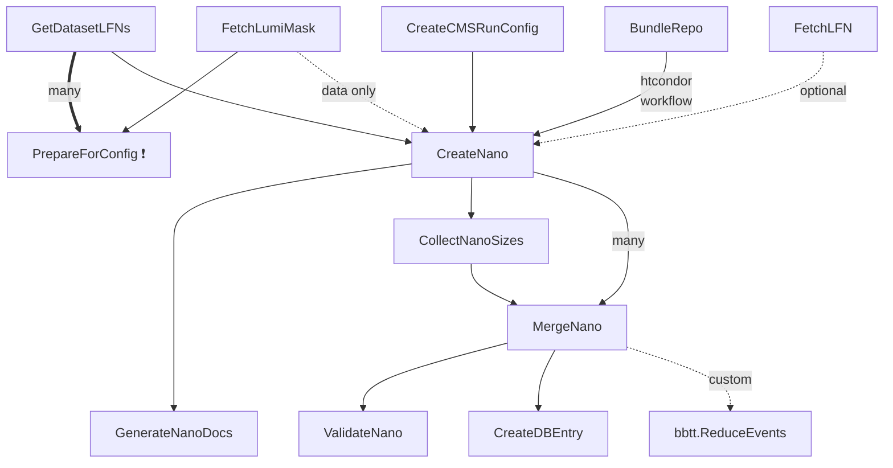

# nanogen

## Setup

Set environment variables before sourcing `setup.sh` and consider creating an alias.

```shell
# required
export NG_CERN_USER="your_cern_username"
# optional (storage location of software and local files; defaults to "/data" in the repo)
export NG_DATA_BASE="/data/dust/user/$( whoami )/nanogen_data"
# setup
source setup.sh ""
```

## Tasks



Almost all tasks have an accompanying `*Wrapper` task that adds functionality like `--dataset-names PATTERNS`, `--skip-dataset-names PATTERNS` to trigger multiple *wrapped* tasks at once.

**❗️ Note:** `PrepareForConfig --config-name ...` should be run **manually** before `CreateNano` or any other task downstream, mainly to have the list of LFNs available a-priori, since dynamic dependency generation can be costly in this case.

## Yaml configs

### General config

The name of general configs **must be in the format** `config_<ERA>_<VNANO>.yaml`.

```yaml
# example

# cmssw setup
cmssw_version: CMSSW_X_Y_Z
scram_arch: el9_amd64_gccXYZ
cmssw_env_name: nanogen
sandbox_script: cmssw_nanogen.sh

# arguments for cmsDriver.py that creates the cmsRun config
global_tag:
  mc: ...
  data: ...
era:
  # use anchor if same era
  mc: &era Run3
  data: *era

# lumi mask for data
lumi_mask: /path/or/url/to/lumi_mask.json

# postfix for produced nano datasets in the cms-store-like path
campaign_postfix: NanoAODv<VNANO>UHH

# references to dataset and nano configs
dataset_config: datasets_<ERA>.yaml
nano_config: nano_run3_<VNANO>.yaml

```

### Dataset entries in `datasets_*.yaml` files

#### Central samples

```yaml
# example

# standard dataset entry
tt_dl:
  # the miniaod key
  key: /TTTo2L2Nu_TuneCP5_13TeV-powheg-pythia8/RunIISummer20UL16MiniAODAPVv2-106X_mcRun2_asymptotic_preVFP_v11-v1/MINIAODSIM

  # list of lfns to skip (optional)
  skip_lfns:
    - ...

  # custom era to use for this dataset, defaults to the era of the config (optional)
  era: optional_custom_era

  # custom gt to use for this dataset, defaults to the gt of the config (optional)
  global_tag: optional_custom_gt

  # custom campaign postfix, defaults to the postfix of the config (optional)
  campaign_postfix: optional_custom_postfix


# extension of tt_dl
# ❗️ name must start with tt_dl and end with _ext{N}
tt_dl_ext1:
  # all other fields as shown above
  key: ...


# variation of tt_dl
# ❗️ name must start with tt_dl and end with _{up,down}
# (to standardize the naming of the cmsdb entry which requires a specific format)
tt_dl_tune_up:
  # all other fields as shown above
  key: ...

# data with optional jec era specification
data_e_c:
  key: ...
  jec_era: RunCD
```

#### Privately produced samples

```yaml
hh_vbf_hbb_htt_kv1_k2v0_kl1_prv_madgraph:
  # a fake miniaod key (note the UHH suffix behind the miniaod campaign)
  key: /VBFHHto2B2Tau_CV_1_C2V_0_C3_1_TuneCP5_13p6TeV_madgraph-pythia8/Run3Summer22MiniAODv4UHH-130X_mcRun3_2022_realistic_v5-v2/MINIAODSIM

  # a private mapping entry qualifies the dataset as being private
  private:
    # local path where mini files are stored
    path: /data/dust/user/riegerma/mcgen_vbf_data/outputs/vbf_22pre_cv1.0_c2v0.0_kl1.0
    # regex pattern to match the mini files
    regex: mini_.+_.+_500\.root
    # a dataset id that will be used in the cmsdb entry export
    id: 22761002
```

## References

- General nano docs: [https://gitlab.cern.ch/cms-nanoAOD/nanoaod-doc](https://gitlab.cern.ch/cms-nanoAOD/nanoaod-doc)
- Private productions: [https://gitlab.cern.ch/cms-nanoAOD/nanoaod-doc/-/wikis/Instructions/Private-production](https://gitlab.cern.ch/cms-nanoAOD/nanoaod-doc/-/wikis/Instructions/Private-production)
- CMS DAS: [https://cmsweb.cern.ch/das](https://cmsweb.cern.ch/das)
- HLepRare: [https://cms-higgs-leprare.docs.cern.ch/#common-hleprare-nanoaod-skims](https://cms-higgs-leprare.docs.cern.ch/#common-hleprare-nanoaod-skims)
