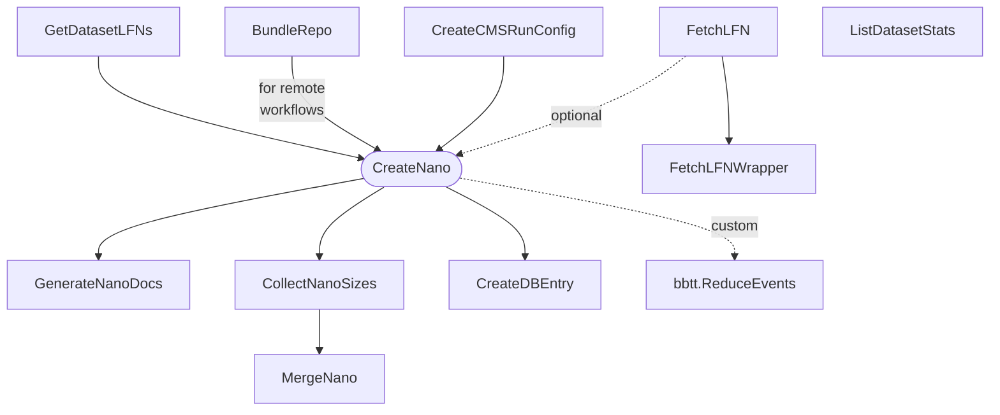

# nanogen

## Setup

Set environment variables before sourcing `setup.sh` and consider creating an alias.

```shell
export NG_CERN_USER="your_cern_username"
export NG_DATA_BASE="/nfs/dust/cms/user/$( whoami )/nanogen"  # e.g. dust
source setup.sh ""
```

## Tasks



Almost all tasks have an accompanying `*Wrapper` task that adds functionality like `--dataset-names PATTERNS`, `--skip-dataset-names PATTERNS` to trigger multiple *wrapped* tasks at once.

**Note:** `GetDatasetLFNs` should be run **manually** before `CreateNano` or any other task downstream, since dynamic dependency generation can be costly in this case.

## Yaml configs

### General config

TODO.

### Dataset entries in `datasets_*.yaml` files

```yaml
# example

# standard dataset entry
tt_dl:
  # the miniaod key
  key: /TTTo2L2Nu_TuneCP5_13TeV-powheg-pythia8/RunIISummer20UL16MiniAODAPVv2-106X_mcRun2_asymptotic_preVFP_v11-v1/MINIAODSIM

  # list of lfns to skip (optional)
  skip_lfns:
    - ...

  # custom era to use for this dataset, defaults to the era of the config (optional)
  era: optional_custom_era

  # custom gt to use for this dataset, defaults to the gt of the config (optional)
  global_tag: optional_custom_gt

  # custom campaign postfix, defaults to the postfix of the config (optional)
  campaign_postfix: optional_custom_postfix


# extension of tt_dl
# ❗️ name must start with tt_dl and end with _ext{N}
tt_dl_ext1:
  # all other fields as shown above
  key: ...


# variation of tt_dl
# ❗️ name must start with tt_dl and end with _{up,down}
# (to standardize the naming of the cmsdb entry which requires a specific format)
tt_dl_tune_up:
  # all other fields as shown above
  key: ...
```

## References

- General nano docs: https://gitlab.cern.ch/cms-nanoAOD/nanoaod-doc
- Private productions: https://gitlab.cern.ch/cms-nanoAOD/nanoaod-doc/-/wikis/Instructions/Private-production
- CMS DAS: https://cmsweb.cern.ch/das
