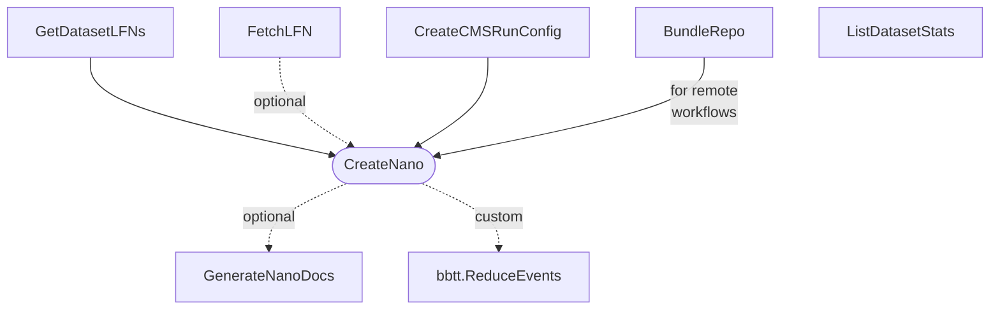

# nanogen

## Setup

Set environment variables before sourcing `setup.sh` and consider creating an alias.

```shell
export NG_CERN_USER="your_cern_username"
export NG_DATA_BASE="/nfs/dust/cms/user/$( whoami )/nanogen"  # e.g. dust
source setup.sh ""
```

## Tasks



Almost all tasks have an accompanying `*Wrapper` task that adds functionality like `--dataset-names PATTERNS`, `--skip-dataset-names PATTERNS` to trigger multiple *wrapped* tasks at once.

**Note:** `GetDatasetLFNs` should be run **manually** before `CreateNano` or any other task downstream, since dynamic dependency generation can be costly in this case.

## References

- General nano docs: https://gitlab.cern.ch/cms-nanoAOD/nanoaod-doc
- Private productions: https://gitlab.cern.ch/cms-nanoAOD/nanoaod-doc/-/wikis/Instructions/Private-production
- CMS DAS: https://cmsweb.cern.ch/das
